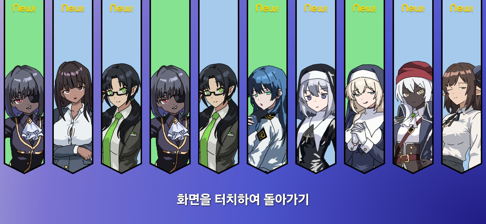
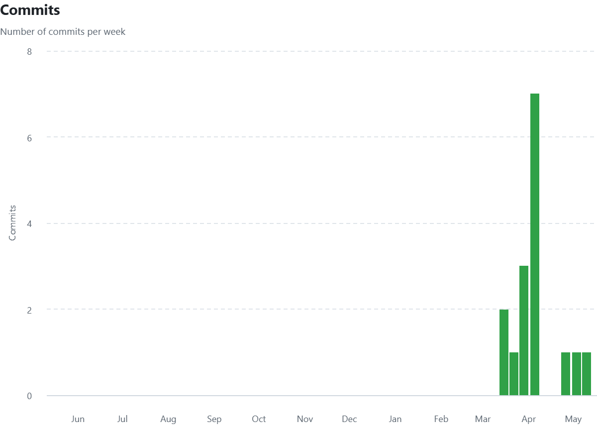
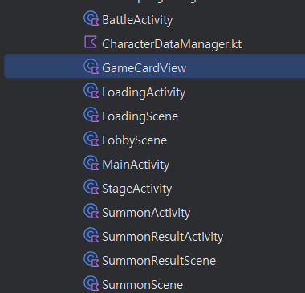

# 프로젝트 제목
Upon the World's Trace 
## 발표 영상 자료에 대한 링크

## 프로젝트 Git Repository 에 대한 링크
https://github.com/ghjd13/gachaGame

## README.md 에 대한 링크
https://github.com/ghjd13/gachaGame/blob/main/readme.md

# 개발 범위

## 게임 컨셉
모바일 게임의 장르 중 하나인 미소녀 수집 게임을 간단하게 구현하고
수집한 캐릭터를 가지고 적과 전투를 하는 게임을  구상했습니다.
이런 게임을 만든 이유로는 관련하여 미소녀 리소스를 많이 만들 일이 생겼고 이를 활용하기 위해 구상했습니다.

## 개발 범위
크게 미소녀 수집과 전투 두 부분만을 집중해 개발할 생각입니다.
미소녀 수집은 각 희귀 등급에 따라 차등적으로 획득 가능
전투는 카드 형식의 스킬을 선택해 적을 공격하거나 아군에 버프를 주는 방식

전투에서 쓸 수 있는 캐릭터는 3명만 구현할 예정

## 예상 게임 실행 흐름
 
 

## 개발 일정: 4월 6일에 시작하는 주를 1주차로 하여 8주간의 주단위 상세 개발 일정을 제시.
- 1주차: xml 기반인 기존 개발 자료를 프레임워크로 포팅
- 2주차: 기존에 만든 가챠 시스템 작동되는지 테스트, SD 캐릭터, 카드 리소스 제작
- 3-4주차: 전투 시스템 구축
- 5-6주차: 캐릭터 데이터 구축 및 연동
- 7-8주차: 디버깅, 유지보수

# 2차 발표
## 게임에 대한 간단한 소개 (1차 발표때 이미 소개했으므로 떠올릴 정도만 해도 좋음)
미소녀 수집 게임을 비스무리하게 구현을 하고 

## 현재까지의 진행 상황 (항목별 진행 정도를 %로 표시할 것)
- 1주차: xml 기반인 기존 개발 자료를 프레임워크로 포팅 [80%]
- 2주차: 기존에 만든 가챠 시스템 작동되는지 테스트, SD 캐릭터, 카드 리소스 제작 [20%]
- 3-4주차: 전투 시스템 구축 [0%]
- 5-6주차: 캐릭터 데이터 구축 및 연동 [10%]
- 7-8주차: 디버깅, 유지보수 [0%]

## git commit 을 얼마나 자주 했는지 알 수 있는 자료 (github-insights-commits 포함)
 
프로젝트가 시작되기 전에 주로 커밋을 자주했고 1차 발표 이후에는 개인 사정 등으로 라이브러리 연동에만 집중

목표가 변경되었다면 변경된 내용과 이유 (합당하지 않는 경우 감점)
## Activity 구성
## Scene 구성 및 전환 관계

크게 세개의 씬으로 나뉘어짐, 로비, 가챠, 전투
현재 전투를 제외한 두 씬은 사실상 완성
로비를 통해서 가챠, 전투를 들어갈 수 있고 가챠에서 전투, 전투에서 가챠로 갈려면 반드시 로비씬을 통해야 함

## 구현하면서 특히 어려웠던/어려운 부분
1차발표 전에 xml을 중심으로 작업을 했었는데 라이브러리 기반으로 다시 작업하면서 오류나 그런 부분들이 터져나와서 힘들었습니다.

## Special Thanks
### HOI4 Anime Mod - Upon the World's Trace 모드팀

<https://discord.com/invite/J545EDWrcQ>
