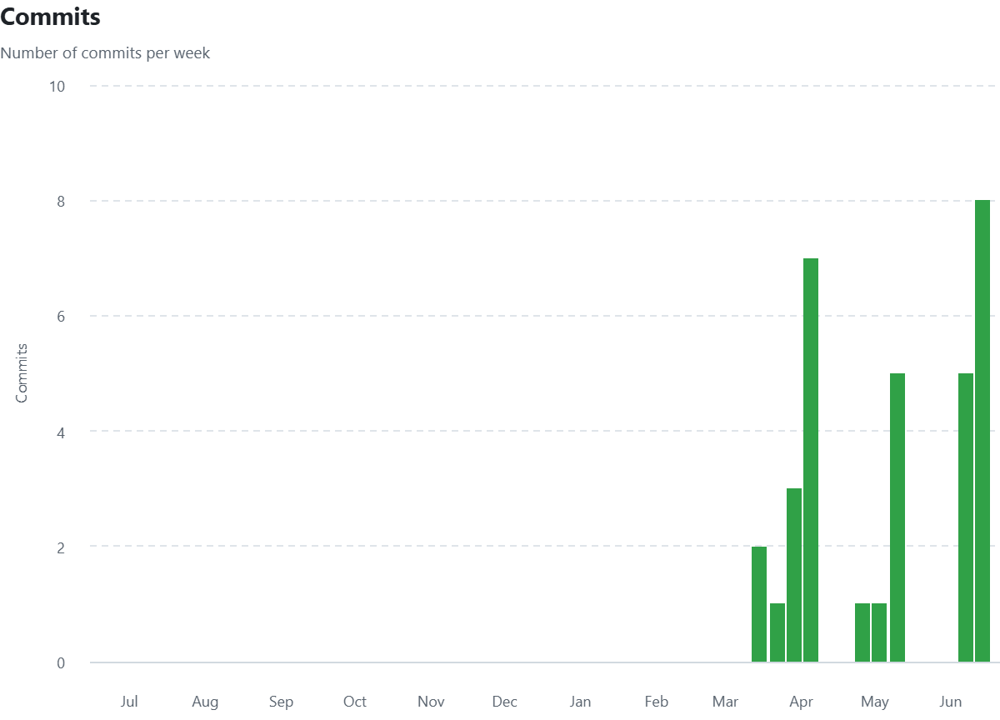
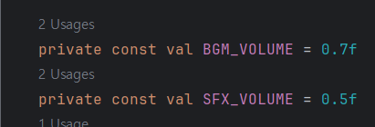
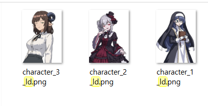

# 프로젝트 제목
Upon the World's Trace 
## 발표 영상 자료에 대한 링크

## 프로젝트 Git Repository 에 대한 링크
https://github.com/ghjd13/gachaGame

## README.md 에 대한 링크
https://github.com/ghjd13/gachaGame/blob/main/readme.md

# 개발 범위

## 게임 컨셉
모바일 게임의 장르 중 하나인 미소녀 수집 게임을 간단하게 구현하고
수집한 캐릭터를 가지고 적과 전투를 하는 게임을  구상했습니다.
이런 게임을 만든 이유로는 관련하여 미소녀 리소스를 많이 만들 일이 생겼고 이를 활용하기 위해 구상했습니다.

## 개발 범위
크게 미소녀 수집과 전투 두 부분만을 집중해 개발할 생각입니다.
미소녀 수집은 각 희귀 등급에 따라 차등적으로 획득 가능
전투는 카드 형식의 스킬을 선택해 적을 공격하거나 아군에 버프를 주는 방식

전투에서 쓸 수 있는 캐릭터는 3명만 구현할 예정

## 예상 게임 실행 흐름
 
 

## 개발 일정: 4월 6일에 시작하는 주를 1주차로 하여 8주간의 주단위 상세 개발 일정을 제시.
- 1주차: xml 기반인 기존 개발 자료를 프레임워크로 포팅
- 2주차: 기존에 만든 가챠 시스템 작동되는지 테스트, SD 캐릭터, 카드 리소스 제작
- 3-4주차: 전투 시스템 구축
- 5-6주차: 캐릭터 데이터 구축 및 연동
- 7-8주차: 디버깅, 유지보수

# 2차 발표
## 게임에 대한 간단한 소개 (1차 발표때 이미 소개했으므로 떠올릴 정도만 해도 좋음)
미소녀 수집 게임을 비스무리하게 구현을 하고 간단한 전투로 프로토타입을 만들어보는 것이 목표인 수집게임

## 현재까지의 진행 상황 (항목별 진행 정도를 %로 표시할 것)
- 1주차: xml 기반인 기존 개발 자료를 프레임워크로 포팅 [80%]
- 2주차: 기존에 만든 가챠 시스템 작동되는지 테스트, SD 캐릭터, 카드 리소스 제작 [20%]
- 3-4주차: 전투 시스템 구축 [0%]
- 5-6주차: 캐릭터 데이터 구축 및 연동 [10%]
- 7-8주차: 디버깅, 유지보수 [0%]

## git commit 을 얼마나 자주 했는지 알 수 있는 자료 (github-insights-commits 포함)
 

프로젝트가 시작되기 전에 주로 커밋을 자주했고 1차 발표 이후에는 개인 사정 등으로 라이브러리 연동에만 집중

목표가 변경되었다면 변경된 내용과 이유 (합당하지 않는 경우 감점)
## Activity 구성
## Scene 구성 및 전환 관계

크게 세개의 씬으로 나뉘어짐, 로비, 가챠, 전투
현재 전투를 제외한 두 씬은 사실상 완성
로비를 통해서 가챠, 전투를 들어갈 수 있고 가챠에서 전투, 전투에서 가챠로 갈려면 반드시 로비씬을 통해야 함

## 구현하면서 특히 어려웠던/어려운 부분
1차발표 전에 xml을 중심으로 작업을 했었는데 라이브러리 기반으로 다시 작업하면서 오류나 그런 부분들이 터져나와서 힘들었습니다.

# 3차 발표
## 게임에 대한 간단한 소개
- 블루 아카이브 등 미소녀 수집 게임을 레퍼런스 삼아, 간단한 가챠 시스템과 전투 시스템을 구현한 게임을 만들려했습니다.
- 기본적으로 소환과 전투만 집중해서 개발했습니다.(다른 버튼은 사용불가)
- 소환은 흔히 아는 것 처럼 등급에 따라 다른 확률로 캐릭터들이 나오는 것을 구현했습니다.
- 전투는 횡스크롤 슈팅으로 스킬(회복만 구현)등을 활용해 적들을 물리치는 것을 구상했습니다.

 

## 개발 계획/일정/실제 진행
 
- 그 이전: xml 기반으로 기초 제작(이전 주차들 : 13)
- 1주차: xml 기반인 기존 개발 자료를 프레임워크로 포팅 [100%] (1주차: 0)
- 2주차: 기존에 만든 가챠 시스템 작동되는지 테스트, SD 캐릭터, 카드 리소스 제작 [100%](2주차: 1)
- 3-4주차: 전투 시스템 구축 [90%] (3주차: 5, 4주차: 1)
- 5-6주차: 캐릭터 데이터 구축 및 연동 [20%] (5주차: 0, 6주차: 0)
- 7-8주차: 디버깅, 유지보수 [50%] (7주차: 5, 8주차 8)
- 주차별 커밋 횟수를 github 자료를 인용하여 표시한다.

## 목표가 변경되었다면 변경된 내용과 이유 (합당하지 않는 경우 감점)
기존에 계획한 것은 카드 게임이었으나 슈팅게임으로 변경하였습니다. 일단 카드게임의 난이도가 생각보다 높기도 했었고 a2dg라이브러리를 사용하고 있는 상황에서 활용할 수 있는 부분(게이지, 배경, 사운드 등)이 슈팅 게임이 더 어울릴 거라 판단을 했습니다.
 

## 다음 사항을 구체적으로 나열한다.

- 사용된 기술
  - 서로 다른 속도로 움직이는 배경, 캐릭터 시트 애니메이션, 배경음악과 효과음으로 나누어진 사운드

- 수업내용에서 차용한 것
  - 쿠키런을 참고해서 서로 다른 속도로 움직이는 배경과 캐릭터의 움직임, 캐릭터 시트를 활용한 애니메이션에 활용했습니다.

- 참고한 것
  - 바르코 사운드, 수노, 제미나이를 통한 배경, 효과음 제작

- 직접 개발한 것
  - 이미지 리소스는 일부 배경을 제외하면 전부 제미나이를 활용해 트레이싱 후 사용했습니다.
-  
  - 사운드에서 불륨을 배경용과 효과음용으로 분리해서 사용했습니다. 
 

## 아쉬운 점

- 하고 싶었지만 못 한 것들
-  
  - 원래 구상은 최소 세 캐릭터를 만들고 1캐릭터당 1스킬을 만들고 싶었지만 시간관계상 하지 못했습니다. 
  - 그리고 레벨업이라던가 재화등 성장요소를 추가하고 뽑기를 통해 캐릭터를 성장시키고 싶었습니다만 아쉽게도 못하였습니다.

- (앱을 스토어에 판다면) 팔기 위해 보충할 것들
  - 일단 기본적으로 사운드라던가 캐릭터라던가 코드상에서 아예 지정을 해서 하드코딩이 되버린 부분이 있는데 이 부분을 변수로 변화하거나 해서 다른 캐릭터로도 작동이 되게 해야할 것 같습니다.
  - 미완성된 다른 캐릭터들의 리소스들을 완성하고 개성있는 스킬들을 추가해야겠습니다.
  - 더 많은 적들

- 결국 해결하지 못한 문제/버그
- 
  - 초기에는 이렇게 새로 얻은 캐릭터는 new표시가 뜨게 했었는데 라이브러리에 연동하면서 이게 문제가 생겨서 아쉽게 지웠습니다.

- 기말 프로젝트를 하면서 겪은 어려움에 대해 소개해도 좋다
  - 사실 1주차부터 프로젝트를 시작해서 가챠화면까지 대충 완성했었는데 근데 그게 하필이면 xml 기반이라 다시 연동한 부분이 어려웠던 거 같습니다.
 

## 수업에 대한 내용 (발표 영상에 포함할 것)

- 이번 수업에서 기대한 것, 얻은 것, 얻지 못한 것
  - 사실 지난 겨울 학기 때 안드로이드 스튜디오를 접할 경험이 있었는데 사실 그때는 많이 불쾌했던 경험으로 느꼈는데 이 수업을 들으면서 생각보다는 괜찮은 프로그램이라는 걸 얻은 것 같았습니다.

- 더 좋은 수업이 되기 위해 변화할 점 ("답정너"가 아니며, 유의미한 지적에 대해서는 점수 보상을 약속합니다)
  - 처음부터 완성된 라이브러리를 주고 수업에서 이게 어떤 구조로 되어있는지 설명해주는 방법도 괜찮을 것 같습니다.

## Special Thanks
### HOI4 Anime Mod - Upon the World's Trace 모드팀

<https://discord.com/invite/J545EDWrcQ>
