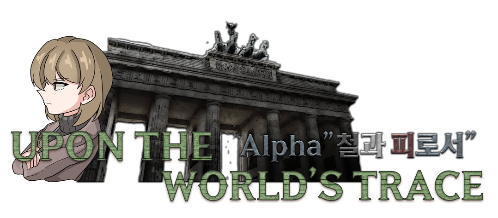

# 프로젝트 제목
Upon the World's Trace 
## 발표 영상 자료에 대한 링크

## 프로젝트 Git Repository 에 대한 링크
https://github.com/ghjd13/gachaGame

## README.md 에 대한 링크
https://github.com/ghjd13/gachaGame/blob/main/readme.md

# 개발 범위

## 게임 컨셉
모바일 게임의 장르 중 하나인 미소녀 수집 게임을 간단하게 구현하고
수집한 캐릭터를 가지고 적과 전투를 하는 게임을  구상했습니다.
이런 게임을 만든 이유로는 관련하여 미소녀 리소스를 많이 만들 일이 생겼고 이를 활용하기 위해 구상했습니다.

## 개발 범위
크게 미소녀 수집과 전투 두 부분만을 집중해 개발할 생각입니다.
미소녀 수집은 각 희귀 등급에 따라 차등적으로 획득 가능
전투는 카드 형식의 스킬을 선택해 적을 공격하거나 아군에 버프를 주는 방식

전투에서 쓸 수 있는 캐릭터는 3명만 구현할 예정

## 예상 게임 실행 흐름
 
 

## 개발 일정: 4월 6일에 시작하는 주를 1주차로 하여 8주간의 주단위 상세 개발 일정을 제시.
- 1주차: xml 기반인 기존 개발 자료를 프레임워크로 포팅
- 2주차: 기존에 만든 가챠 시스템 작동되는지 테스트, SD 캐릭터, 카드 리소스 제작
- 3-4주차: 전투 시스템 구축
- 5-6주차: 캐릭터 데이터 구축 및 연동
- 7-8주차: 디버깅, 유지보수

## Special Thanks
# HOI4 Anime Mod - Upon the World's Trace 모드팀

